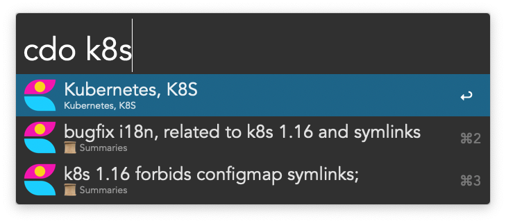

# Craft Docs Workflow

Note search for [Craft Docs](https://www.craft.do) using [Alfred](https://www.alfredapp.com).

## Prerequisites

You need Node to be installed and `node` and `npm` to be available in one of these places:
* `/usr/local/bin`;
* `/usr/bin`;
* `/usr/sbin`;
* `/bin`;
* `/sbin`.

GUI applications do not inherit `$PATH`, and the workflow searches though these dirs for the required binaries. 

## Install

[Download](https://github.com/kudrykv/alfred-craftdocs/releases/download/v0.1.1/CraftDocs.alfredworkflow)
the latest release and double-click it.
Alfred will proceed with installation.

Using Alfred, run `craftdo-init` command to set up the workflow.
This will download dependencies workflow requires (about 270 MB).

## Search
Run `cdo <query>` to search for documents.

