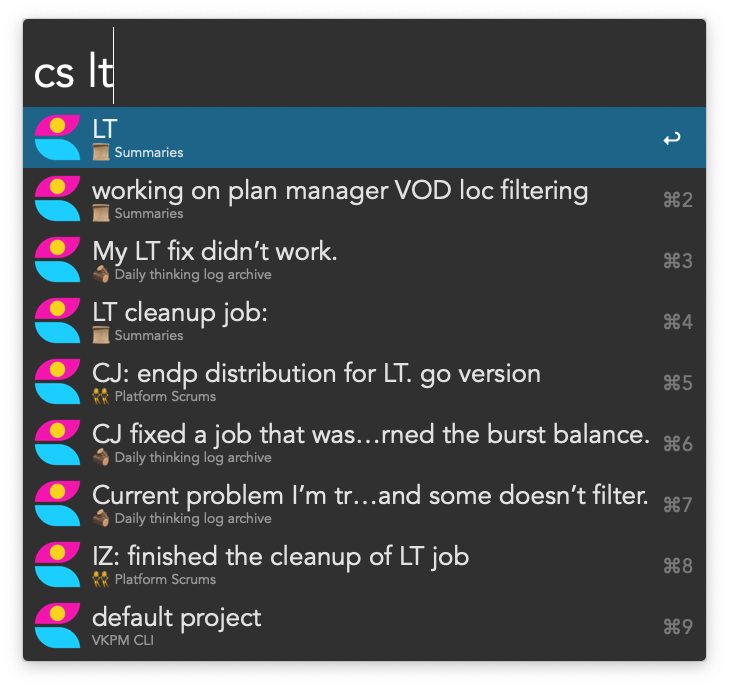
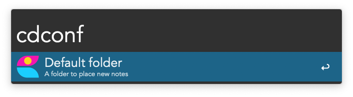
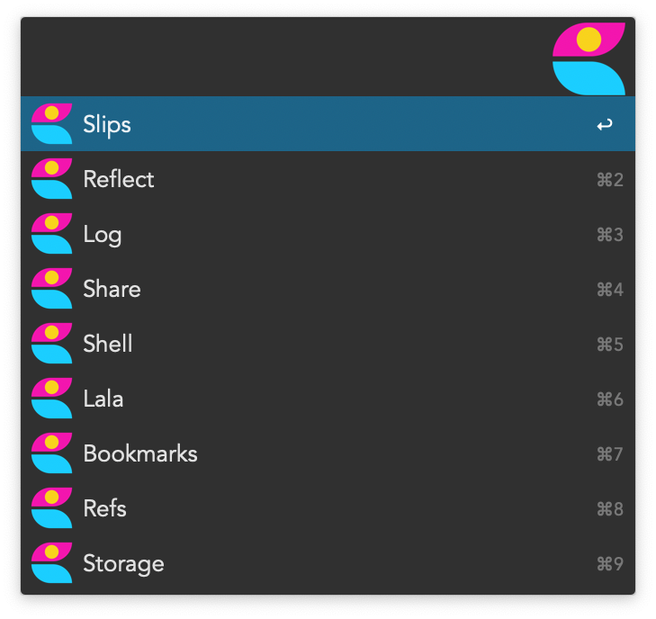

# Craft Docs Workflow
Note search for [Craft Docs](https://www.craft.do) using [Alfred](https://www.alfredapp.com).

## Prerequisites
You need Node to be installed.
Search paths are specified in `PATHS` workflow variable.
By default, it's these paths:
* `/usr/local/bin`;
* `/usr/bin`;
* `/usr/sbin`;
* `/bin`;
* `/sbin`.

You may add yours by editing the `PATHS` workflow variable.

Workflow does not inherit `$PATH`, hence it needs an explicit list of places to search. 

## Install
[Download](https://github.com/kudrykv/alfred-craftdocs/releases/download/v0.2.3/Craft_Docs_v0.2.3.alfredworkflow)
the latest release and double-click it.
Alfred will proceed with installation.

Using Alfred, run `cdinit` command to set up the workflow.
This will download dependencies workflow requires (about 270 MB).

# Usage
At the first run, execute `cdinit` to initialize the workflow.

## Search
Run `cs <query>` to search for documents.

## Create a daily note
Run `cdo` and select "today" to create daily note.

You will need to configure the default folder for storing these notes though.
To do that, run `cdconf`.

To configure the pattern for today's note, open the workflow variables in the Alfred.

## Configuration
Run `cdconf` to configure some workflow values.

Select the folder where all your new notes will be created.

